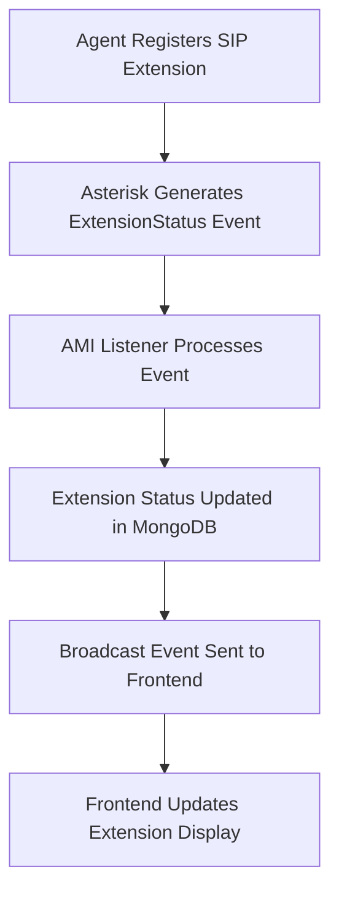

# Extension Management System

This document provides comprehensive information about the extension seeding and management system for the Call Center application.

## 📋 Overview

The extension management system provides tools to seed, check, and manage phone extensions for the call center. Extensions are automatically created with predefined ranges, random agent assignments, and proper department categorization.

## 🎯 Extension Ranges

### Support Extensions: 1001-1020
- **Department**: Support  
- **Team**: Support Team
- **Count**: 20 extensions
- **Purpose**: Customer support agents

### Sales Extensions: 2001-2020
- **Department**: Sales
- **Team**: Sales Team  
- **Count**: 20 extensions
- **Purpose**: Sales agents

## 🚀 Quick Start

### Seed All Extensions
```bash
# Using npm script
npm run seed-extensions

# Direct execution
node scripts/seedExtensions.js

# Using batch script (Windows)
seed-extensions.bat

# Using shell script (Unix/Linux)
./seed-extensions.sh
```

### Check Extension Status
```bash
# Check current extensions in database
npm run check-extensions

# Direct execution
node scripts/checkExtensions.js
```

## 📊 Extension Properties

Each extension is created with the following properties:

| Property | Description | Example |
|----------|-------------|---------|
| `extension` | Extension number (string) | "1001", "2015" |
| `agent_name` | Random agent name | "John Smith", "Jane Doe" |
| `status` | Current status (default: offline) | "offline", "online", "unknown" |
| `last_seen` | Last activity timestamp | null (initially) |
| `is_active` | Whether extension is active | true |
| `context` | Asterisk context | "ext-local" |
| `hint` | SIP hint for Asterisk | "SIP/1001" |
| `metadata` | Additional information | Department, team, shift |

### Metadata Structure
```json
{
  "department": "Support" | "Sales",
  "team": "Support Team" | "Sales Team", 
  "shift": "Day" | "Night"
}
```

## 🎲 Agent Names Pool

The system uses a predefined pool of 40 realistic agent names:

**Sample Names**: John Smith, Jane Doe, Michael Johnson, Sarah Wilson, Robert Brown, Lisa Davis, David Miller, Emma Garcia, James Rodriguez, Olivia Martinez, William Anderson, Sophia Taylor, Benjamin Thomas, Isabella Jackson, Lucas White, Mia Harris, Henry Clark, Charlotte Lewis, Alexander Lee, Amelia Walker, Sebastian Hall, Harper Allen, Ethan Young, Evelyn King, Jacob Wright, Abigail Lopez, Samuel Hill, Emily Scott, Daniel Green, Elizabeth Adams, Matthew Baker, Sofia Gonzalez, Joseph Nelson, Avery Carter, Andrew Mitchell, Scarlett Perez, Joshua Roberts, Grace Turner, Christopher Phillips, Chloe Campbell

## 🔧 Available Scripts

### Package.json Scripts
```json
{
  "seed-extensions": "node scripts/seedExtensions.js",
  "check-extensions": "node scripts/checkExtensions.js"
}
```

### Script Files
- `scripts/seedExtensions.js` - Main seeding script
- `scripts/checkExtensions.js` - Database verification script
- `seed-extensions.bat` - Windows batch script
- `seed-extensions.sh` - Unix/Linux shell script

## 📱 Script Features

### seedExtensions.js
- ✅ Creates 40 extensions (1001-1020 + 2001-2020)
- ✅ Assigns random agent names
- ✅ Sets all extensions to offline status by default
- ✅ Clears existing extensions before seeding
- ✅ Provides detailed progress feedback
- ✅ Shows summary statistics
- ✅ Includes help flag support (`--help`)

### checkExtensions.js  
- ✅ Displays total extension count
- ✅ Shows breakdown by department and range
- ✅ Reports status distribution
- ✅ Lists sample extensions from each range
- ✅ Identifies missing extensions
- ✅ Provides helpful command suggestions

## 🔍 Example Output

### Seeding Process
```
🌱 Starting Extension Seeding Process...
📋 Will create extensions: 1001-1020 (Support) and 2001-2020 (Sales)
👤 Each extension will have a random agent name and offline status

✅ Connected to MongoDB
📊 Found 0 existing extensions
🗑️ Clearing existing extensions...
✅ Cleared existing extensions
📞 Generated 20 support extensions (1001-1020)
📞 Generated 20 sales extensions (2001-2020)
✅ Successfully inserted 40 extensions

📋 Extension Seeding Summary:
==================================================
Total Extensions Created: 40
Support Extensions (1001-1020): 20
Sales Extensions (2001-2020): 20
Default Status: offline
Default Context: ext-local

🎉 Extension seeding completed successfully!
```

### Status Check
```
📊 Extension Database Summary
==================================================
Total Extensions: 40
Support Extensions (1001-1020): 20/20
Sales Extensions (2001-2020): 20/20

📈 Status Distribution:
------------------------------
offline: 40

🏢 Department Distribution:
------------------------------
Sales: 20
Support: 20

✅ All expected extensions are present!
```

## 🔄 Integration with AMI

### Real-time Status Updates
Extensions integrate seamlessly with the AMI listener system:

1. **Initial State**: All extensions start as "offline"
2. **AMI Detection**: When agents register SIP extensions, AMI detects them
3. **Status Update**: Extension status automatically updates to "online"
4. **Real-time Sync**: Frontend receives live status updates

### AMI Event Flow


## 📡 Frontend Integration

### Extension Management Page
The seeded extensions automatically appear in the frontend Extension Management page:

- **Status Indicators**: Visual status (online/offline/unknown)
- **Agent Information**: Names and extension numbers
- **Department Filtering**: Filter by Support/Sales
- **Real-time Updates**: Live status changes via WebSocket
- **Sync Functionality**: Manual sync with Asterisk

### Real-time Service
```javascript
// Extensions are automatically updated via broadcast events
import broadcast from './services/BroadcastService.js';

broadcast.onExtensionStatusUpdated((extension) => {
  console.log(`Extension ${extension.extension} is now ${extension.status}`);
});
```

## 🗄️ Database Schema

### MongoDB Collection: extensions
```javascript
{
  _id: ObjectId,
  extension: String (unique, indexed),
  agent_name: String,
  status: String (enum: ['online', 'offline', 'unknown']),
  last_seen: Date,
  is_active: Boolean,
  context: String,
  hint: String,
  metadata: {
    department: String,
    team: String,
    shift: String
  },
  createdAt: Date,
  updatedAt: Date
}
```

### Indexes
- `extension` - Unique index for fast lookups
- `status` - Index for status filtering
- `is_active` - Index for active extension queries
- `last_seen` - Index for activity sorting
- Compound indexes for optimal query performance

## 🛠️ Customization

### Modifying Extension Ranges
To change the extension ranges, edit `scripts/seedExtensions.js`:

```javascript
// Current ranges
const supportExtensions = generateExtensions(1001, 1020);
const salesExtensions = generateExtensions(2001, 2020);

// Custom ranges example
const supportExtensions = generateExtensions(1000, 1050); // 51 extensions
const salesExtensions = generateExtensions(2000, 2100); // 101 extensions
```

### Adding More Agent Names
Add names to the `agentNames` array in `seedExtensions.js`:

```javascript
const agentNames = [
  'John Smith', 'Jane Doe', // ... existing names
  'Your New Name', 'Another Agent Name'
];
```

### Custom Metadata
Modify the `generateExtensions` function to add custom metadata:

```javascript
metadata: {
  department: i >= 2000 ? 'Sales' : 'Support',
  team: i >= 2000 ? 'Sales Team' : 'Support Team',
  shift: Math.random() > 0.5 ? 'Day' : 'Night',
  // Add your custom fields
  location: 'Office A',
  skill_level: Math.floor(Math.random() * 5) + 1
}
```

## 🚨 Troubleshooting

### Common Issues

#### No Extensions Created
**Symptoms**: Script runs but no extensions appear
**Solutions**: 
- Check MongoDB connection string in `.env`
- Verify MongoDB is running
- Check for authentication errors in logs

#### Duplicate Extension Errors
**Symptoms**: `MongoError: E11000 duplicate key error`
**Solutions**:
- Extensions already exist in database
- Clear existing extensions first
- Use different extension ranges

#### Permission Errors
**Symptoms**: Cannot write to database
**Solutions**:
- Check MongoDB user permissions  
- Verify database exists and is accessible
- Check network connectivity

### Debug Commands
```bash
# Check MongoDB connection
mongosh "mongodb://localhost:27017/call_center_shajgoj"

# View existing extensions
db.extensions.find().count()
db.extensions.find({}, {extension:1, agent_name:1, status:1})

# Clear all extensions manually
db.extensions.deleteMany({})
```

## 🔗 Related Documentation

- [AMI Integration README](AMI_README.md) - Complete AMI setup guide
- [Main Project README](README.md) - Overall project documentation
- [API Documentation](../README.md) - API endpoints and usage

## 📞 Support

For issues with extension seeding or management:

1. Run the check script: `npm run check-extensions`
2. Review the troubleshooting section above
3. Check MongoDB and Node.js logs
4. Verify AMI integration for real-time updates
5. Test frontend integration in Extension Management page

## 🎉 Success Checklist

After running the extension seeder, verify:

- ✅ 40 extensions created (20 Support + 20 Sales)
- ✅ All extensions have status "offline" 
- ✅ Random agent names assigned
- ✅ Proper department categorization
- ✅ Extensions appear in frontend
- ✅ AMI listener can update statuses
- ✅ Real-time updates work in browser

Your call center extension system is now ready for use! 🚀